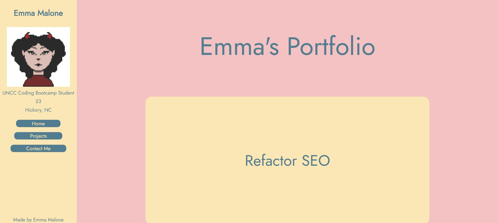
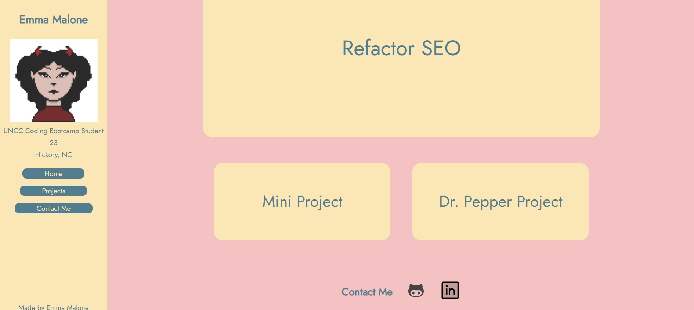
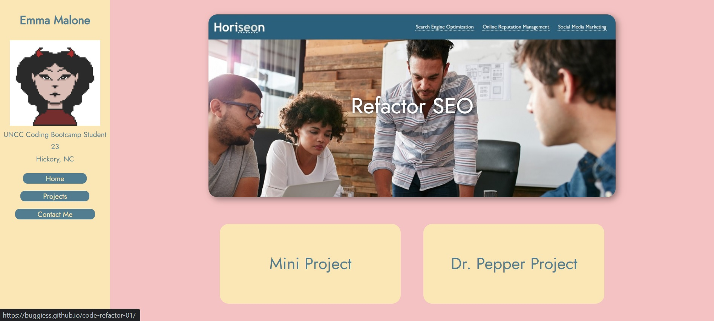

# Emma's Portfolio

## Table of Contents
- [Description](#description)
- [Visuals](#visuals)

## Description

This is a personal portfolio in which I exhibit my knowledge of html and css to format a seemless and acessible webpage. The page is divided into several parts, notably, the sidebar, body, and footer. The navigation is smooth and efficient so that it doesn't move abruptly. There are several links on the page that take you to a new tab. The hover on the cards show a preview of the page it leads to.

## Visuals

